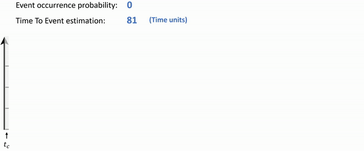

# Real-Time Event Prediction
<a name="readme-top"></a>

This repository includes implementation of our studies that propose novel methods for 
real-time event prediction for heterogeneous multivariate temporal data (time series, instantaneous events, and time intervals).


In the animation below, V1 and V2 are time series, V3 represents instantaneous events, and V4 represents time intervals.
The animation shows that the probability of experiencing an event of interest (heart attack here) increases over time (tc represents the current time), while the estimated time to event decreases.




<!-- TABLE OF CONTENTS -->
<details>
  <summary>Table of Contents</summary>
  <ol>
    <li>
      <a href="#background">Background</a>
    </li>
    <li>
      <a href="#about-the-project">About The Project</a>
    </li>
    <li>
      <a href="#citations-and-papers">Citations & Papers</a>
    </li>
    <li>
      <a href="#getting-started">Getting Started</a>
      <ul>
        <li><a href="#input-files">Input Files</a></li>
        <li><a href="#config-file">Configuration</a></li>
        <li><a href="#installation">Installation</a></li>
      </ul>
    </li>
    <li><a href="#usage">Usage</a></li>
    <li><a href="#contributing">Contributing</a></li>
    <li><a href="#license">License</a></li>
    <li><a href="#acknowledgments">Acknowledgments</a></li>
	<li><a href="#Dedication">Dedication</a></li>
  </ol>
</details>

<!-- Background -->
## Background
Symbolic time intervals (STIs) are a powerful way to represent time-series data and real-life events with varying duration, such as traffic light timing or medical treatments. STIs can be used to uniformly represent heterogeneous multivariate temporal data (time series, instantaneous events, or time intervals), including both event-driven measurements (e.g., traffic accidents) and manual measurements (e.g., blood tests).
Temporal abstraction can be used to uniformly represent such heterogeneous multivariate temporal data using STIs. 
Frequent time intervals-related patterns (TIRPs) can be discovered from the STI data, which have proven to be valuable for knowledge discovery, as well as for use as features in classification and prediction tasks.

<!-- ABOUT THE PROJECT -->
## About The Project
Our method builds on our previous work on the continuous prediction of a single TIRP completion.
The completion of a TIRP can be inferred by calculating the probability of observing the remaining part of the pattern, given its observed part at a specific time.
We also implemented an extension of the single TIRP completion model to be capable of estimating the TIRP's completion occurrence time, in addition to the completion probability.
By continuously aggregating multiple completion models for TIRPs that end with an event of interest, we learn a continuous event prediction model that is capable of estimating the event's occurrence probability and time.
A model that leverages multiple TIRPs is expected to generalize better than a model that uses a single TIRP.

<p align="right">(<a href="#readme-top">back to top</a>)</p>

<!-- Citations & Papers -->
## Citations and Papers
Prediction of TIRP completion - PAKDD'2023 (Pacific-Asia Conference on Knowledge Discovery and Data Mining) [[Link](https://dl.acm.org/doi/abs/10.1007/978-3-031-33374-3_19)]:

`Itzhak, N., Jaroszewicz, S., & Moskovitch, R. (2023, May). Continuously predicting the completion of a time intervals related pattern. In Pacific-Asia Conference on Knowledge Discovery and Data Mining (pp. 239-251). Cham: Springer Nature Switzerland.`

Prediction of TIRP completion - Knowledge and Information Systems - Journal version [[Link](https://link.springer.com/article/10.1007/s10115-023-01910-w)]:

`Itzhak, N., Jaroszewicz, S., & Moskovitch, R. (2023). Continuous prediction of a time intervals-related pattern’s completion. Knowledge and Information Systems, 1-50.`

**To find more relevant papers on this topic or similar topics, please visit my [Google Scholar profile](https://scholar.google.com/citations?user=mxSMEeoAAAAJ&hl=en&oi=ao).**

<p align="right">(<a href="#readme-top">back to top</a>)</p>

<!-- GETTING STARTED -->
## Getting Started


### Input Files

#### STI Data

Our proposed methods require STI data. 
If you have heterogeneous multivariate temporal data (time series and events), 
you must transform it into STI format before using this repository.
You must also provide time-intervals related patterns (TIRPs) as input.

Note: This repository does not include temporal abstraction methods or time-intervals mining algorithms 
because these are not part of our work' contributions.
However, there are many other repositories that provide these methods,
so you should use them before running this code.

The following files are required as input:

1. _Training set_ (see for example `input/STI data/sti_train.csv`) - 
A set that is used to learn the models. 
The format should be as following: 
    ```csv
    SeriesID,VarID,SymbolID,StartTime,EndTime
    1.0,1.0,3.0,2.0,49.0
    1.0,1.0,2.0,50.0,67.0
    1.0,2.0,4.0,9.0,10.0
    ...
    1512.0,9.0,27.0,2.0,25.0
    1512.0,10.0,28.0,2.0,25.0
    1512.0,11.0,33.0,2.0,25.0
    1512.0,999.0,999.0,26.0,27.0
    ```
    Where the columns are:
   * `SeriesID` - _float_; the entity ID (for example, patient ID)
   * `VarID` - _float_; the variable ID (for example, blood pressure)
   * `SymbolID` - _float_; the symbol ID (for example, high blood pressure). 
   Mote: the symbol ID must be unique even if the VarId is different. 
   The event of interest's index is defined in the `const` file as explain later.
We defined the event of interest's index to be 999.0 and in the last row of the CSV it
can be seen that the event of interest was occurred (`1512.0,999.0,999.0,26.0,27.0`).
   * `StartTime` - _float_; the symbol's start time
   * `EndTime` - _float_; the symbol's end time
   
    It's very important to make sure that in entities that the event of interest has occurred,
the event of interest will have the latest start time and the latest end time of other STIs will be earlier to
the event of interest's start time.
This means only temporal relations of meets or before are supported with the event of interest.  


2. _Testing set_ (see for example `input/STI data/sti_test.csv`) -
Same format as the training set descriptions but used of evaluation of the methods instead of learning the methods.


3. Patterns (see for example `input/STI data/patterns.csv`) -
Provided TIRPs that are relevant for the model learning.
For the provided TIRPs, only those that ends with the event of interest are used.
Note: the index of the event of interest needs to be defined in the `const` file.
The format should be as following: 
    ```
    STIs,TempRels,VerSupp,HorSupp
    "[1, 10, 6]","['c', 'c', 'b']",0.06097560975609756,7.8
    "[1, 10, 6, 1]","['c', 'c', 'b', 'b', 'b', 'b']",0.06097560975609756,7.8
    ...
    "[1, 5, 999]","['c', 'b', 'b']",0.17682926829268292,2.413793103448276
    "[1, 5, 15, 999]","['c', 'c', 'b', 'b', 'b', 'b']",0.054878048780487805,6.888888888888889
    ```
	Where the columns are:
   * `STIs` - _str_; represents an array of STIs
   * `TempRels` - _str_; represents an array of Allen's seven temporal relations 
   (with the following chars: `BEFORE = 'b'`, `MEETS = 'm'`, `CONTAINS = 'c'`, `EQUALS = 'e'`,
   `FINISHED_BY = 'f'`, `OVERLAPS = 'o'`, `STARTS = 's'`) 
   * `VerSupp` - _float_; _currently not used_; represents the vertical support of a TIRP, 
   which means the percentage of entities found to have at least one instance of the TIRP).
   * `HorSupp` - _float_; _currently not used_; represents the mean horizontal support of a TIRP, 
   which represents the averaged number of a TIRP's instances that were discovered in an entity
	
    We defined the event of interest's index to be 999.0.
    Thus, the first two rows will be ignored as they represent TIRPs that not end with the event of interest.
    In contrast, the last rows will be used as they TIRPs that end with the event of interest.

    For example, the last row (`"[1, 5, 15, 999]","['c', 'c', 'b', 'b', 'b', 'b']"`) represents a TIRP with the STIs "1", "5", "15", and "999"
with the following temporal relations:

    ```
           5      15      999             
     1    'c'     'c'     'b'  
     5            'b'     'b'
     15                   'b'
 
    ```
   
    while the indices of the temporal relations in the array `['c', 'c', 'b', 'b', 'b', 'b']` are located in this order:
	```
           5      15     999             
     1     0      1       3  
     5            2       4
     15                   5
 
    ```

    Examples of TIRP instances could be:

    ```
    ----------------1-------------------
             -------------5---------
                 -------15------
                                                       -999-
    ```
 
    OR:

    ```
    ----------------1-------------------
             -------5-----
                  -15-
                                             -999-
    ```
 
    OR:
   
    ```
    ----------------1-------------------
      --------------5-----------------
        -------------15--------------
                                                                           -999-
    ```
 	
    and many more...

#### Raw Data
TBD

<p align="right">(<a href="#readme-top">back to top</a>)</p>

### Configuration

The `cont.py` file contains configuration that can be changed for the experiments.

* `EVENT_INDEX` - Represent the index of the event. The data should contain events with symbol and variable id with the same value.
The default is 999.
* `TAU_EXP` - an array of `tau` values (time delays) that used for the model prediction.
* `W_EXP` - an array of `w` values (window sizes) that used for the model prediction.
* Input folders and files names - define the input folder and the input files as describe above.
* Model parameters - Dictionaries with all relevant parameters can be defined and provided for the experiments.
Some models using these dictionaries for hyperparameters to find the best parameters for the model. 

<p align="right">(<a href="#readme-top">back to top</a>)</p>

### Installation

The `requirements.txt` file lists all Python libraries that the project depend on,
and they will be installed using:

 ```sh
 pip install -r requirements.txt
 ```

<p align="right">(<a href="#readme-top">back to top</a>)</p>


<!-- USAGE EXAMPLES -->
## Usage

**The code is divided as follows** 

  * `main.py`: This Python file contains the main code for running the model learning process.
  * `core_comp`: This folder contains all the files for the core classes of time intervals components.
  * `tirp_prefixes`: This folder contains all the files for the TIRP-Prefix definitions and detection.
  * `prediction`: This folder contains all the files for the prediction classes of TIRP's completion (e.g., SCPM, FCPM, and XGBoost-based models).

**The flow**

The given code processes and evaluates predictive models for events of interest using time interval data.

Let's break down the flow of the code step by step:

1. **Load Data**: The code starts by defining various file paths. These paths point to different CSV files that contain data. It includes paths for STI data, raw data, and pattern data.
The code also loads the training and test sets. 
It also extracts labels for the test set and the time of the event of interest from the test set.
This is used for model evaluation.

2. **Pattern Data**: It loads patterns data.
This patterns data will be used to build models.

3. **Model Building Loop**: The code then enters a loop that iterates over patterns that end with the event of interest.
For each pattern, it does the following:
   * Learns probability models for the pattern. 
   It learns different probability models for the given pattern using different methods or parameters.
   * Learns a time model for the pattern.
   * Performs post-training cleanup.
   
4. **Prediction Loop**: After building the models for all patterns end with the event of interest, 
the code enters another loop that iterates over entities in the test set. 
For each entity, it does the following:
   * Predicts the probability and time to event using specific models.
   * Aggregates the predicted probability and time.
   * Stores the aggregated prediction.

5. **Model Evaluation**: After making predictions for all test entities, 
the code evaluates the learned models. 
It calculates metrics like AUC-ROC and AUPRC using specific evaluation parameters (tau and w). 
Then, the code prints the metrics to the console.

<!-- CONTRIBUTING -->
## Contributing

Any contributions you make are **greatly appreciated**.

If you have a suggestion that would make this better, please fork the repo and create a pull request.
You can also simply open an issue with the tag "enhancement".

Don't forget to give the project a star! 

Thanks again!
<p align="right">(<a href="#readme-top">back to top</a>)</p>


<!-- LICENSE -->
## License

Distributed under the MIT License. See `LICENSE.txt` for more information.

<p align="right">(<a href="#readme-top">back to top</a>)</p>


<!-- ACKNOWLEDGMENTS -->
## Acknowledgments

I would like to thank Tali Malenboim, Lior Tkach, and Shani Bahat for their help in debugging this repository,
asking questions, and providing comments.

These students plan to continue my PhD work, 
and they have done a great job of understanding all the complex aspects of this research in order to implement
their own ideas in the future. 

I wish you all the best with your research, and I hope this repository will help you achieve your academic goals.

<p align="right">(<a href="#readme-top">back to top</a>)</p>

<!-- DEDICATION -->
## Dedication
In memory of Lior Tkach (M.Sc. student in Prof. Robert Moskovitch's lab: https://www.ise.bgu.ac.il/cdalab/),
who was tragically killed in a terror attack on October 7th, 2023.

Lior's passion for knowledge and dedication to his work were evident in his constructive comments and
pivotal role in debugging the code for this repository. 
His memory lives on in our hearts and in the work we continue to do.

<p align="right">(<a href="#readme-top">back to top</a>)</p>

<!-- MARKDOWN LINKS & IMAGES -->
<!-- https://www.markdownguide.org/basic-syntax/#reference-style-links -->
[contributors-shield]: https://img.shields.io/github/contributors/othneildrew/Best-README-Template.svg?style=for-the-badge
[contributors-url]: https://github.com/othneildrew/Best-README-Template/graphs/contributors
[forks-shield]: https://img.shields.io/github/forks/othneildrew/Best-README-Template.svg?style=for-the-badge
[forks-url]: https://github.com/othneildrew/Best-README-Template/network/members
[stars-shield]: https://img.shields.io/github/stars/othneildrew/Best-README-Template.svg?style=for-the-badge
[stars-url]: https://github.com/othneildrew/Best-README-Template/stargazers
[issues-shield]: https://img.shields.io/github/issues/othneildrew/Best-README-Template.svg?style=for-the-badge
[issues-url]: https://github.com/othneildrew/Best-README-Template/issues
[license-shield]: https://img.shields.io/github/license/othneildrew/Best-README-Template.svg?style=for-the-badge
[license-url]: https://github.com/othneildrew/Best-README-Template/blob/master/LICENSE.txt
[linkedin-shield]: https://img.shields.io/badge/-LinkedIn-black.svg?style=for-the-badge&logo=linkedin&colorB=555
[linkedin-url]: https://linkedin.com/in/othneildrew
[product-screenshot]: images/screenshot.png
[Next.js]: https://img.shields.io/badge/next.js-000000?style=for-the-badge&logo=nextdotjs&logoColor=white
[Next-url]: https://nextjs.org/
[React.js]: https://img.shields.io/badge/React-20232A?style=for-the-badge&logo=react&logoColor=61DAFB
[React-url]: https://reactjs.org/
[Vue.js]: https://img.shields.io/badge/Vue.js-35495E?style=for-the-badge&logo=vuedotjs&logoColor=4FC08D
[Vue-url]: https://vuejs.org/
[Angular.io]: https://img.shields.io/badge/Angular-DD0031?style=for-the-badge&logo=angular&logoColor=white
[Angular-url]: https://angular.io/
[Svelte.dev]: https://img.shields.io/badge/Svelte-4A4A55?style=for-the-badge&logo=svelte&logoColor=FF3E00
[Svelte-url]: https://svelte.dev/
[Laravel.com]: https://img.shields.io/badge/Laravel-FF2D20?style=for-the-badge&logo=laravel&logoColor=white
[Laravel-url]: https://laravel.com
[Bootstrap.com]: https://img.shields.io/badge/Bootstrap-563D7C?style=for-the-badge&logo=bootstrap&logoColor=white
[Bootstrap-url]: https://getbootstrap.com
[JQuery.com]: https://img.shields.io/badge/jQuery-0769AD?style=for-the-badge&logo=jquery&logoColor=white
[JQuery-url]: https://jquery.com 
